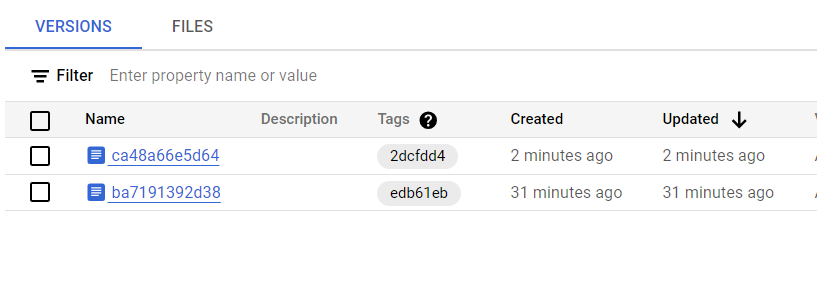
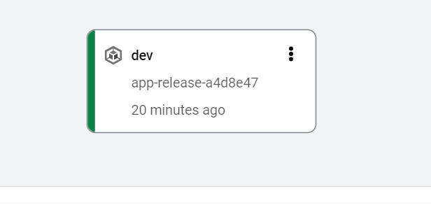
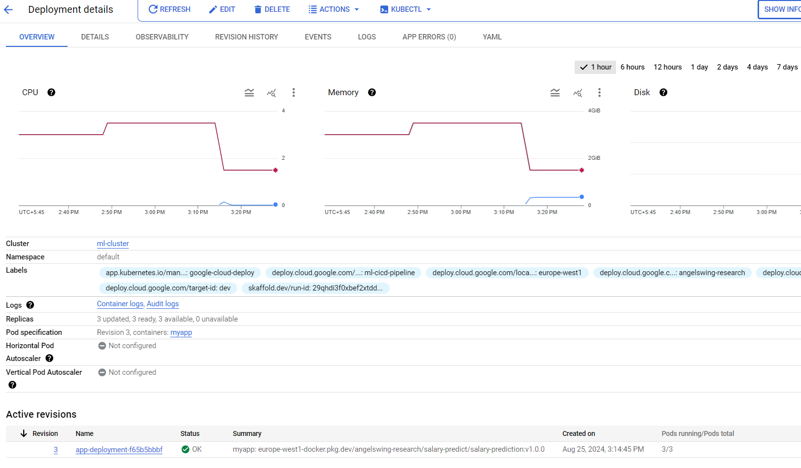
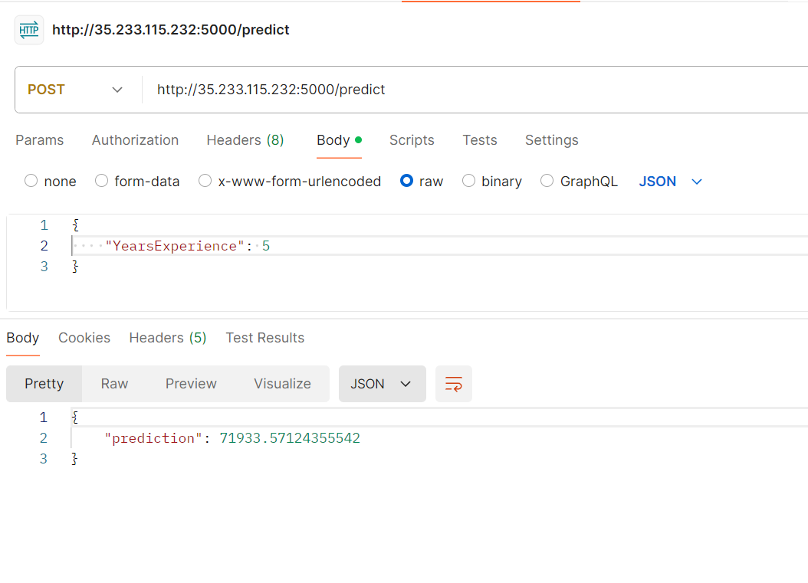

# Salary Prediction App Deployment using Google Cloud
This project involves creating a machine learning model for salary prediction, Dockerizing the application, and deploying it automatically using Google Cloud Build triggers.

## Table of Contents
1. [Project Overview](#project-overview)
2. [Prerequisites](#prerequisites)
3. [Model Creation](#model-creation)
4. [Dockerizing the Model](#dockerizing-the-model)
5. [Creating the Kubernetes Cluster](#creating-the-kubernetes-cluster)
6. [Setting Up Google Cloud Build](#setting-up-google-cloud-build)
7. [Setting Up Cloud Build Trigger](#setting-up-cloud-build-trigger)
8. [Testing the Deployment](#testing-the-deployment)
9. [Screenshots](#screenshots)

## Project Overview

The goal of this project is to build a salary prediction model, encapsulate it in a Docker container, and set up a continuous integration and deployment (CI/CD) pipeline using Google Cloud Build and Google Cloud Deploy. This setup ensures that your model is automatically built, tested, and deployed to a Kubernetes cluster whenever changes are made.

## Prerequisites

Before you begin, ensure you have the following:

- Google Cloud account with billing enabled.
- [Google Cloud SDK](https://cloud.google.com/sdk/docs/install) installed.
- [Docker](https://docs.docker.com/get-docker/) installed.
- Access to [Google Artifact Registry](https://cloud.google.com/artifact-registry/docs) for storing Docker images.
- A Kubernetes cluster set up in Google Kubernetes Engine (GKE).

## Model Creation

Create a machine learning model that predicts salaries based on year of experience. Save the model. Then create a flask app that takes the year of experience as request and provided the salary prediction as response.

## Dockerizing the Model

Create a Dockerfile that specifies the environment and dependencies needed to run your model.

## Creating the Kubernetes Cluster
Before deploying your application, you'll need to create a Kubernetes cluster in Google Kubernetes Engine (GKE). 

## Setting Up Google Cloud Build

To set up Google Cloud Build, you need to create a `cloudbuild.yaml` file that defines the steps for building and pushing the Docker image to Google Artifact Registry, deploying the application using Google Cloud Deploy, and releasing it using Skaffold. The build process can be automated using Cloud Build triggers.

## Setting Up Cloud Build Trigger
To set up a Cloud Build trigger, navigate to the Cloud Build section in the Google Cloud Console and create a trigger linked to your source repository. This trigger will automatically build and deploy the Docker image whenever changes are pushed to the specified branch.

## Outputs

Here are some screenshots to illustrate the process:
1. **Cloud Build Summary:**

2. **Artifact Registry:**

3. **Versioning Image:**

4. **Cloud deployed the pipeline for development environment:**

5. **Deployment in Kubernetes engine**

6. **Testing the deployment**
