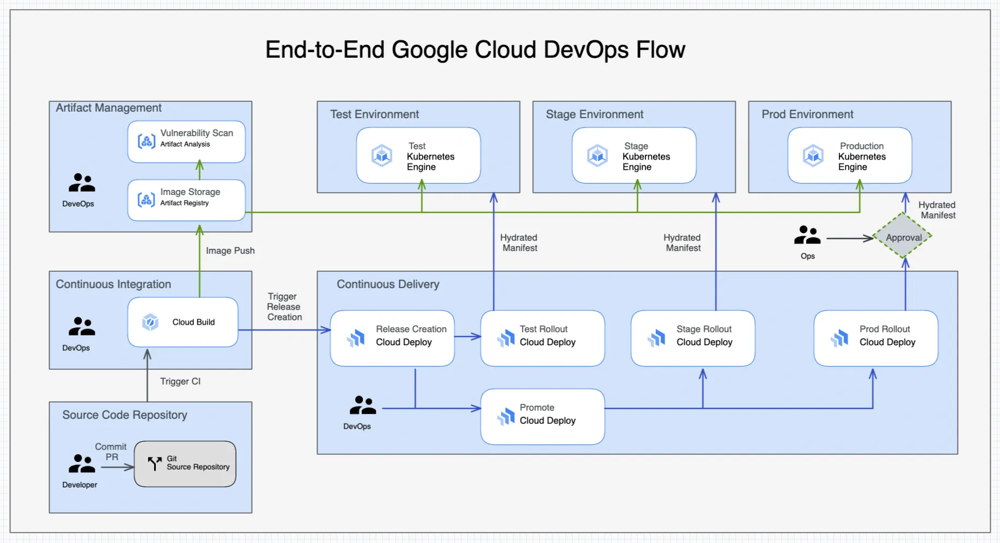

# Salary Prediction App Deployment using Google Cloud
This project involves creating a machine learning model for salary prediction, Dockerizing the application, and deploying it automatically using Google Cloud Build triggers.

## Table of Contents
1. [Project Overview](#project-overview)
2. [Prerequisites](#prerequisites)
3. [Model Creation](#model-creation)
4. [Dockerizing the Model](#dockerizing-the-model)
5. [Setting Up Google Cloud Build](#setting-up-google-cloud-build)
6. [Setting Up Cloud Build Trigger](#setting-up-cloud-build-trigger)
7. [Testing the Deployment](#testing-the-deployment)

## Project Overview

The goal of this project is to build a salary prediction model, encapsulate it in a Docker container, and set up a continuous integration and deployment (CI/CD) pipeline using Google Cloud Build.

## Prerequisites

Before you begin, ensure you have the following:

- Google Cloud account with billing enabled.
- [Google Cloud SDK](https://cloud.google.com/sdk/docs/install) installed.
- [Docker](https://docs.docker.com/get-docker/) installed.
- Access to [Google Artifact Registry](https://cloud.google.com/artifact-registry/docs) for storing Docker images.

## Setting Up Google Cloud Build

To set up Google Cloud Build, you need to create a `cloudbuild.yaml` file that defines the steps for building and pushing the Docker image to Google Artifact Registry. The build process can be automated using Cloud Build triggers.

## Setting Up Cloud Build Trigger
To set up a Cloud Build trigger, navigate to the Cloud Build section in the Google Cloud Console and create a trigger linked to your source repository. This trigger will automatically build and deploy the Docker image whenever changes are pushed to the specified branch.

## Screenshots

Here are some screenshots to illustrate the process:
1. **Cloud Build Trigger Setup:**

2. **Cloud Build Summary:**

3. **Artifact Registry:**
